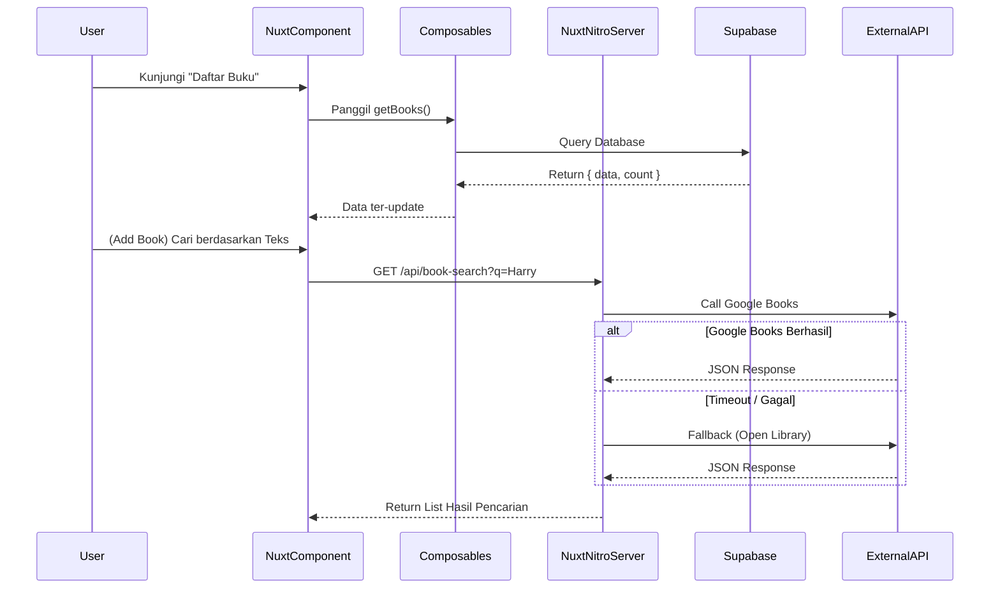

# Review Buku (Nuxt 3 Application)

Aplikasi Web Review Buku ini dibangun menggunakan framework [Nuxt 3](https://nuxt.com/) (Vue.js), [Tailwind CSS](https://tailwindcss.com/) untuk UI styling, dan menggunakan database PostgreSQL dari [Supabase](https://supabase.com/). Misi dari sistem ini adalah menampilkan koleksi bacaan pribadi secara profesional sekaligus mendukung interaksi pengunjung (melalui rating dan komentar).

---

## 🎨 Diagram & Alur Aplikasi (Flow)

Berikut adalah ringkasan skema arsitektur dan aliran data antar-layer aplikasi.

### Arsitektur Umum & Alur Data
flowchart TB
 subgraph UI["UI Layer (Pages/Components)"]
        Home["Halaman Beranda"]
        Catalog["Daftar Buku"]
        Detail["Detail Buku"]
        Admin["Dashboard Admin"]
  end
 subgraph Composables["Composables (State & API Wrappers)"]
        useBooks["useBooks.ts"]
        useRatings["useRatings.ts"]
        useComments["useComments.ts"]
        useBookSearch["useBookSearch.ts"]
  end
 subgraph External["External & Backend (Server/Supabase)"]
        Supabase[("Supabase PostgreSQL")]
        Auth["Supabase Auth"]
        GBooks["Google Books API"]
        OLibrary["Open Library API"]
        Nitro["Nuxt Server/API"]
  end
 subgraph s1["External & Backend (Server/Supabase)"]
        n1[("Supabase PostgreSQL")]
        n2["Supabase Auth"]
        n3["Google Books API"]
        n4["Open Library API"]
        n5["Nuxt Server/API"]
  end
 subgraph s2["Composables (State & API Wrappers)"]
        n6["useBooks.ts"]
        n7["useRatings.ts"]
        n8["useComments.ts"]
        n9["useBookSearch.ts"]
  end
 subgraph s3["UI Layer (Pages/Components)"]
        n10["Halaman Beranda"]
        n11["Daftar Buku"]
        n12["Detail Buku"]
        n13["Dashboard Admin"]
  end
    Home -- Meminta Top Books --> useBooks
    Catalog -- Filter & Paginasi --> useBooks
    Detail -- Meminta Detail Buku & Komentar --> useBooks
    Detail --> useRatings & useComments
    Admin -- Mencari Buku Global --> useBookSearch
    useBooks <-- CRUD / PostgREST --> Supabase
    useRatings <-- Insert --> Supabase
    useComments <-- Insert/Read --> Supabase
    Admin <-- User Validation --> Auth
    useBookSearch -- "GET /api/book-search" --> Nitro
    Nitro -- Fetch (Primary) --> GBooks
    Nitro -. Fetch (Fallback) .-> OLibrary
    n10 -- Meminta Top Books --> n6
    n11 -- Filter & Paginasi --> n6
    n12 -- Meminta Detail Buku & Komentar --> n6
    n12 --> n7 & n8
    n13 -- Mencari Buku Global --> n9
    n6 <-- CRUD / PostgREST --> n1
    n7 <-- Insert --> n1
    n8 <-- Insert/Read --> n1
    n13 <-- User Validation --> n2
    n9 -- "GET /api/book-search" --> n5
    n5 -- Fetch (Primary) --> n3
    n5 -. Fetch (Fallback) .-> n4

    n2@{ shape: rect}
    n3@{ shape: rect}
    n4@{ shape: rect}
    n5@{ shape: rect}
    n6@{ shape: rect}
    n7@{ shape: rect}
    n8@{ shape: rect}
    n9@{ shape: rect}
    n10@{ shape: rect}
    n11@{ shape: rect}
    n12@{ shape: rect}
    n13@{ shape: rect}


### Flow Pencarian Detail Buku



---

## 🏗 Struktur Direktori Project

```text
review-book/
├── assets/         # File statis dan CSS utama (Tailwind entry point).
├── components/     # Komponen UI interaktif (book/BookCard.vue, ui/StarRating.vue, dll).
├── composables/    # Logika bisnis dan fungsi untuk re-usable state/Supabase call.
├── layouts/        # Layout yang menyelimuti aplikasi (default.vue = user, admin.vue = dashboard).
├── middleware/     # Fungsi penengah/penjaga pintu contohnya route guard admin.
├── pages/          # Konfigurasi rute (View-Pages) di Nuxt (index, about, login, dsb).
├── server/api/     # Nuxt Nitro server API endpoints.
├── types/          # Typescript declaration (.ts) dan type safety untuk DB Model.
├── nuxt.config.ts  # Konfigurasi Nuxt environment, plugins, supabase, dan meta head.
└── tailwind.config.ts  # Customisasi token Tailwind.
```

---

## 🗄️ Database Schema (Supabase)

Database ini memfasilitasi operasional baca dan review melalui skema tabel berikut:

1. **`books`** (Daftar Buku)
   - `id` (UUID, PK) - Primary Key
   - `title`, `author` (String) - Judul dan Penulis
   - `slug` (String, Unique) - Format perutean url
   - `cover_url` (Text) - Url cover dari eksternal
   - `genre` (String array) - Array kategori teks
   - `published_year` (Integer) & `pages` (Integer)
   - `read_status` (Enum/String: 'read', 'reading', 'plan')
   - `owner_rating` (Numeric/Float), `avg_rating` (Numeric) 
   - `owner_review` (Text), `pros`, `cons` (Text/Array)
   - `shopee_url`, `tokped_url`, `tiktok_url`, `gramedia_url` (Affiliate Links)

2. **`comments`** (Diskusi User)
   - `id` (UUID, PK)
   - `book_id` (UUID, FK -> books.id)
   - `name`, `email`, `content` (String/Text)

3. **`ratings`** (Interaksi Rate)
   - `id` (UUID, PK)
   - `book_id` (UUID, FK -> books.id)
   - `score` (Integer 1-5)

4. **`profile`** (Data Pribadi Owner)
   - `id` (UUID, PK)
   - `yearly_target` (Integer) - Target baca buku
   - `instagram`, `tiktok`, `saweria_url`, dll (String URL)

---

## 🔌 API & Composables Tersedia

| API / Composable       | Path / Filename             | Deskripsi                                                                 |
|------------------------|-----------------------------|---------------------------------------------------------------------------|
| **useBooks**           | `composables/useBooks.ts`   | Berisi method `getBooks`, `getBookBySlug`, `createBook` untuk integrasi tabel `books`. |
| **useComments**        | `composables/useComments.ts`| Mengemas operasi input / baca tabel `comments`. |
| **useRatings**         | `composables/useRatings.ts` | Mengatasi *score submission* rating buku dari publik. |
| **Book Search Server** | `/api/book-search.get`      | Endpoint backend yang merangkai query dari client dan call fetch Google Books API / OpenLibrary API. |

---

## 💻 Environment Setup & Menjalankan Aplikasi

**1. Persiapan Kebutuhan Server Lokal:**
- Anda membutuhkan Node.js (versi minimal 18.x).
- Buat proyek Supabase di dashboard [supabase.com](https://supabase.com/).

**2. Instalasi:**
```powershell
# Clone kode ke lokal
git clone <repository> review-book
cd review-book

# Install dependencies (NPM)
npm install
```

**3. Konfigurasi Environment (`.env`):**
Duplikasi file konfigurasi environment (jika belum ada, buat file baru `.env` di root direktori):
```env
# Koneksi Basis Data/Cloud Supabase
SUPABASE_URL=https://[PROJECT_ID].supabase.co
SUPABASE_KEY=[ANON_PUBLIC_KEY]

# Bebas diisi untuk keperluan Google Books external API (Opsional)
GOOGLE_BOOKS_API_KEY=[API_KEY_ANDA]
```

**4. Run Dev Server:**
```powershell
npm run dev
```
Buka browser dan arahkan ke http://localhost:3000.

---

## 🧪 Testing (Uji Coba Otomatis)

Project ini dilengkapi dengan test script menggunakan [Vitest](https://vitest.dev/).
Skenario Test lengkap telah dirincikan pada root dokumen `API_TEST_SCENARIOS.md`.

Jalankan perintah ini untuk memulai _Testing Mode_:
```powershell
# Eksekusi unit test di mode Headless CLI
npm run test

# Cek hasil tes yang tersusun dengan User Interface
npm run test:ui

# Tinjau Code Coverage
npm run test:coverage
```

⚙️ **Library Tambahan**: Perangkat seperti Vitest UI dan Playwright sudah disiapkan di dalam konfigurasi untuk mendukung skalabilitas otomatisasi kedepannya.
